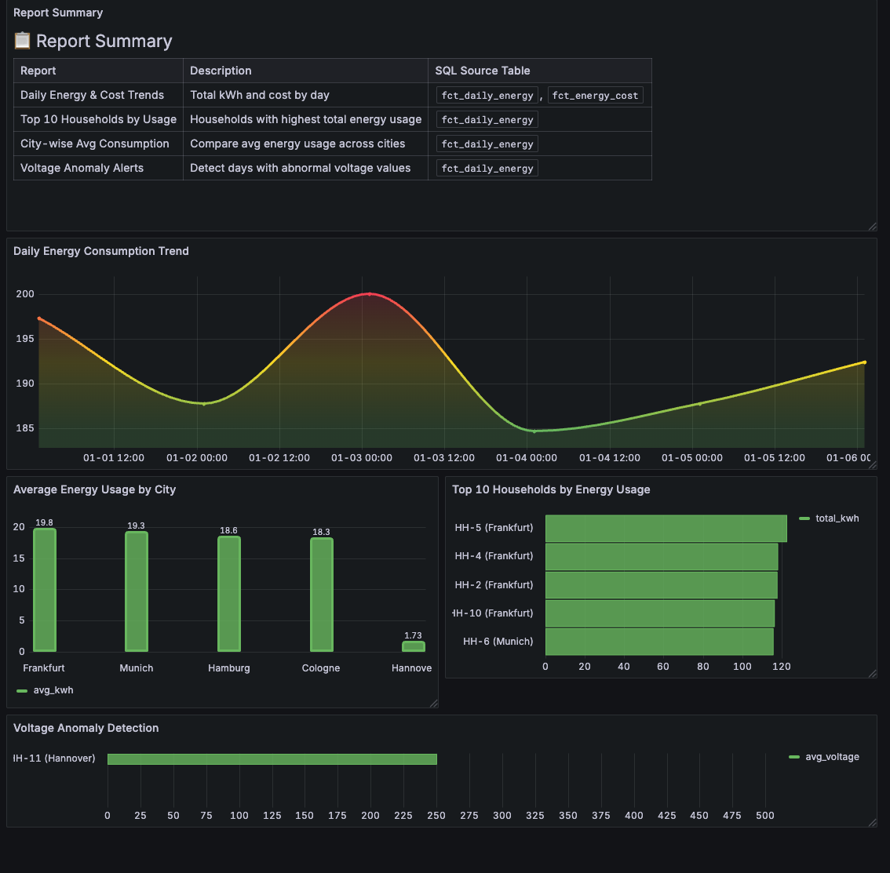
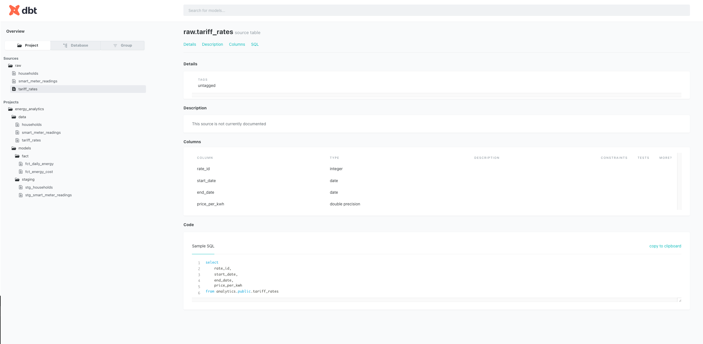

# 📘 Learning Project: Energy Analytics Dashboard with dbt + PostgreSQL + Grafana

This project is designed as a **learning journey** to help you understand how to build an end-to-end analytics pipeline using **dbt**, **PostgreSQL**, and **Grafana**, using simulated smart meter energy data.


> 

---

##  Learning Goals

- Understand how dbt works (models, seeds, tests, sources)
- Practice building transformations from raw data to insights
- Explore PostgreSQL as a warehouse for analytics
- Build Grafana dashboards from SQL models
- Learn about data quality checks and incremental models

---

##  Project Structure Overview

```
.
├── docker-compose.yml        # Runs Postgres, dbt, Grafana locally
├── dbt_project/
│   ├── dbt_project.yml       # dbt config file
│   ├── models/
│   │   ├── staging/          # Clean raw data into stg models
│   │   ├── fact/             # Business logic (e.g., energy summaries)
│   │   └── schema.yml        # Define sources, tests, and descriptions
│   ├── data/                 # Seed data in CSV form
│   └── config/profiles.yml   # dbt connection settings
└── grafana/ (optional)       # Prebuilt dashboards (optional)
```

---

##  Step-by-Step Instructions

### 1. Start Your Local Stack

```bash
git clone https://github.com/ankit-khare-2015/energy-meter-metrics.git
cd energy-meter-metrics
docker-compose up -d
```

This brings up:
- PostgreSQL (data warehouse)
- dbt (transformation engine)
- Grafana (dashboard UI)

---

### 2. Learn dbt: Core Commands

####  Load Raw Data into Postgres (data from /dbt_project/data/* is loaded in postgres database)

##  Seed Data Overview


| Seed File              | Description                                      |
|------------------------|--------------------------------------------------|
| `households.csv`       | Household metadata including city, meter ID, and installation date |
| `smart_meter_readings.csv` | Hourly readings of energy consumption, voltage, and current from each meter |
| `tariff_rates.csv`     | Tariff pricing over date ranges (for cost calculation) |

These tables are referenced as **sources** in dbt models and form the basis for all downstream transformations.

Run this to load them:

```bash
docker exec -it dbt bash
cd /usr/app
dbt seed
```

####  Transform Your Data
```bash
dbt run
```

####  Test Data Quality
```bash
dbt test
```

#### 📚 View Lineage & Docs
```bash
dbt docs generate
dbt docs serve

Console Output
>:/usr/app# dbt docs serve
14:31:36  Running with dbt=1.7.7
Serving docs at 8080
To access from your browser, navigate to: http://localhost:8080
```

> 

Explore your DAG, model descriptions, and test results.

---

## 📊 What You Will Build

### Dashboards in Grafana (http://localhost:3000)
Login: `admin` / `admin`
For each panel:

    Click the three dots (⋮) in the panel's top-right corner

    Select Edit

    Then immediately click Back

    This will force Grafana to refresh the SQL query and pull the data

    This step is needed only once after setup or if data sources were reloaded.

| Report                        | Description                                      | Model/Table              |
|------------------------------|--------------------------------------------------|---------------------------|
| Daily Energy & Cost Trends   | kWh & cost over time                             | `fct_daily_energy`, `fct_energy_cost` |
| Top 5 Households by Usage    | Highest consumers by kWh                         | `fct_daily_energy`        |
| City-wise Avg Consumption    | Avg kWh per city                                 | `fct_daily_energy`        |
| Voltage Anomaly Alerts       | Detect when avg voltage is out of range          | `fct_daily_energy`        |
| Cost Efficiency Overview     | Cost per kWh                                     | `fct_energy_cost`         |

---

##  Explore These Concepts

###  dbt Concepts

- `seeds`: load CSVs into your warehouse
- `models`: SQL files that transform data
- `sources`: define upstream tables (like `raw.smart_meter_readings`)
- `tests`: catch bad data early (e.g., `not_null`, `unique`)
- `ref()` and `source()`: create dependency graph
- `incremental models`: only load new data (advanced)

---

## 🔄 Suggested Next Steps

- Add **incremental logic** to `fct_daily_energy`
- Simulate streaming using **Kafka → PostgreSQL**
- Add more **anomaly detection logic**
- Create alerts in **Grafana**
- Deploy your pipeline to **Cloud (Azure/Snowflake/BigQuery)**
- Explore tools like **Metabase** or **Apache Superset**
- Automate tests using **CI/CD (GitHub Actions)**

---

## 👨‍💻 Created By

Built as a self-learning project by [Ankit Khare](https://www.linkedin.com/in/ankit-khare-2015)  
_Data Architect • Azure • AI • Streaming • dbt • Kafka • Postgres_

